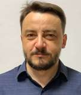

**Сторінка Олександра Пупени (Oleksandr Pupena)**

[Веб версія](https://pupenasan.github.io/)

- Доцент кафедри [АКТСУ](https://www.iasu-nuft.pp.ua/staff) Національного університету харчових технологій, Київ, Україна 
- ФОП з 2023 року
- Соц. мережі і месенджери:
  - [Linkedin](https://www.linkedin.com/in/oleksandr-pupena-67aa0b33/)
  - [Facebook](https://www.facebook.com/fieldbusbook)
  - [YouTube](https://www.youtube.com/c/OleksandrPupena)
  - Telegram channel  https://t.me/+7n6AhGnkEuM1MmJi

  - спільнота [АСУ в Україні Whatsapp](https://chat.whatsapp.com/C7SHk4H3OCo9C6OXFFejdn)

- [Резюме (CV)](cv.md)

## Дисципліни

Веду зараз:

- [Програмна інженерія в системах управління](https://github.com/pupenasan/ProgIngContrSystems)
  - [Простий приклад для курсового проекту](https://github.com/pupenasan/pikursexmpl)
- [Технології Індустрії 4.0](https://github.com/pupenasan/TI40)
- [Розробка і імітаційне моделювання інтегрованих систем керування](https://github.com/pupenasan/rimit)
- [Автоматизовані системи управління (MES рівень)](https://pupenasan.github.io/MOMdisc/)
  - [імітатор обєкту на Node-RED для лабораторних робіт MOM](https://github.com/pupenasan/MOMlabsim)
- [Комп'ютерні мережі та розподілені системи](https://github.com/pupenasan/cmputernetwork)
- [Стратегія цифровізації промислових підприємств](https://pupenasan.github.io/digitalntransform/)

Колись вів:

- [Людино-машинні інтерфейси](https://github.com/pupenasan/hmi)
- [Моніторинг виробничих операцій](https://github.com/pupenasan/monitorproduction)
- [Контролери та їх програмне забезпечення Модуль 2](https://github.com/pupenasan/kpz2)
- [Промислові мережі](https://github.com/pupenasan/fieldbus)

- [Проектування комп'ютерно-іентгрованих систем керування](https://github.com/pupenasan/pkis)

- [Batch Control](https://github.com/pupenasan/batchcontrol)

## Електронні посібники та довідники

- [Автоматизація технологічних процесів та виробництв](https://asu-in-ua.github.io/atpv/)  - це варіант “народного” посібника-довідника, що доповнюється усіма  бажаючими спеціалістами, за умови проходження попередньої редакції.

- [Промислові мережі та інтеграційні технології](https://pupenasan.github.io/fieldbusbook/2010/)
- [Розроблення людино-машинних інтерфейсів та систем збирання даних з використанням програмних засобів SCADA/HMI](https://pupenasan.github.io/hmibook/)
- [Програмування промислових контролерів в Unity PRO та Control Expert](https://pupenasan.github.io/controlexpertbook/)
- [Довідник з Node-RED](https://pupenasan.github.io/NodeREDGuidUKR)
- [Автоматизація промислових виробництв. Ельперін І.В. Пупена О.М. Сідлецький В.М. Швед С.М.](https://pupenasan.github.io/avpbook/)

## Інші загальнодоступні проекти

- [PACFramework](https://github.com/pupenasan/PACFramework)
  - [PACFramework tools](https://github.com/pupenasan/pacframework-tools)
  - [PACFrameworkIoTGateway](https://github.com/pupenasan/PACFrameworkIoTGateway)
- [Git для всіх](https://pupenasan.github.io/Git4All)
- [Англо-український тлумачний словник термінів в АСКТП](https://github.com/pupenasan/ControlDict)
- [Гранти в Індустрії 4.0](https://pupenasan.github.io/grants/)
- [Підкасти "Довкола автоматики"](https://youtube.com/playlist?list=PLgPzuQLDYQEOw2YDBEYONvg8CaHZgYjBf)
- [Технічний день автоматизації (ТДА)](tda.in.ua)

## Professional skills

- PLC programmer: S7 (Step7 TIA Portal), Shcneider Electric (Unity PRO/Control Expert, Machine Expert and other) 
- SCADA programmer: Aveva Plant SCADA/SCADA Citect, zenon, WinCC Comfort
- Fieldbuses
- LoCode: Node-RED, Appsmith, Ubos 
- I40/IIoT: MQTT, OPC UA
- standards: ISA-88, ISA-95, ISA-101, ISA-18.2 and IEC analogs 
- computer programming languages:  VB/VBA, JS        

## Портфоліо

До відкриття ФОП приймав участь в багатьох проектах здебільшого як програміст АСКТП (PLC, SCADA), зокрема на обєктах:

- цукрового виробництва (дифузійне, сокоочистка, випарка, вакуум-апарати продуктового відділення)
- цільномолочне виробництво
- воодочистка
- НБК ОУ
- хімічне виробництво
- газорозподіл
- інші

У якості ФОП надаю послуги по розробленню та впровадженню прикладного ПЗ:

- молочне виробництво - прямий підряд Яготинський маслозавод (постійний замовник)
- олійне виробництво (у субпідряді)
- веб-диспетчеризація водоканалу на базі IIoT (у субпідряді) 
- веб-кабінет власників автомийок самообслуговування на базі IIoT, прямий підряд Premium Wash (постійний замовник)
  - [Кейс цифровізації: електронний кабінет власника автомийок самообслуговування](portfolio/premiumwash1.md)

- програмне забезпечення керування ростерами обсмажки кави

- збір даних, обробка, збереження на краю (Edge), інтегрування з IT-системами та платформами через HTTP REST, MQTT або інші способи - періодичні підряди від різних компаній    

Надаю послуги викладача:

- в навчальному центрі Шнейдер Електрик Україна
- в навчальному центрі Фесто Дидактика Україна
- індивідуально (20 USD/годину)
