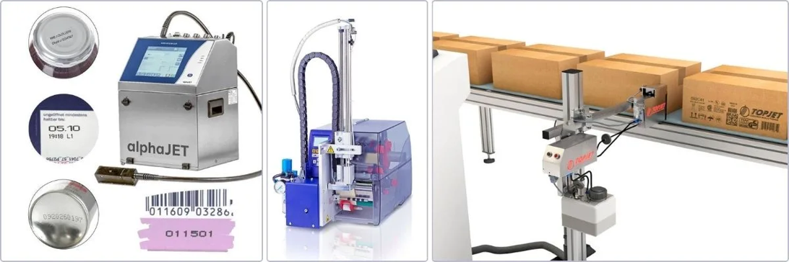
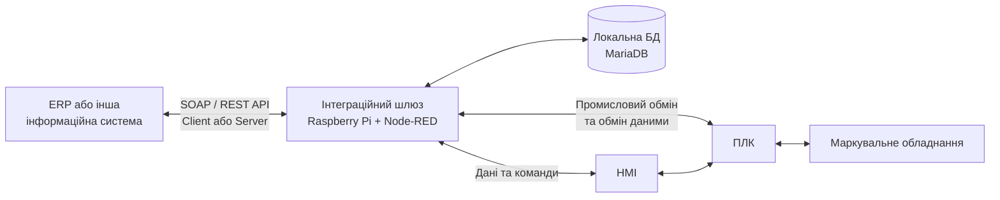

[Сторінка Олександра Пупени](../README.md) -> [Портфоліо](README.md)

# Інтеграція промислового маркувального обладнання з ERP та іншими інформаційними системами

**Замовник і партнер:** Євроджет — системний інтегратор і постачальник обладнання та комплексних рішень промислового маркування.

**Тип рішення:** сімейство інтеграційних шлюзів на спільній архітектурній основі, адаптованих до конкретного обладнання, виробничих процесів та інформаційних систем підприємств.

**Статус:** реалізовано й впроваджено на кількох виробничих об’єктах; кількість реалізацій зростає.

## 1. Назва та короткий опис

У межах співпраці з компанією Євроджет я розробляю програмні шлюзи, які інтегрують системи промислового маркування з ERP та іншими інформаційними системами підприємств. Рішення поєднує виробниче обладнання й інформаційний рівень: отримує завдання та дані для друку, обмінюється ними із системою керування обладнанням, фіксує результати й передає їх до зовнішніх систем.

В основу покладено Raspberry Pi з Node-RED і локальною базою даних. Архітектура спільна для різних впроваджень, але функції, моделі даних, протоколи та сценарії обміну адаптуються під вимоги конкретного підприємства.

## 2. Призначення та сфера застосування

Рішення призначене для виробничих підприємств, на яких потрібна узгоджена робота маркувального обладнання та облікових чи виробничих інформаційних систем.

Воно дає змогу:

- передавати на обладнання завдання на друк і необхідні дані маркування;
- повертати в інформаційну систему фактичні результати виконання;
- відстежувати стан завдань, етикеток і маркованих одиниць продукції;
- забезпечувати простежуваність аж до окремого ідентифікатора етикетки, зокрема SSCC там, де його використовують;
- зменшувати потребу в ручному перенесенні даних між системами;
- підтримувати роботу виробничої ділянки за тимчасової недоступності зовнішньої системи.

Залежно від об’єкта це може бути логістичне маркування, друк етикеток для коробів і палет, облік надрукованого, повторний друк або передавання даних про маркування в інші системи підприємства.

## 3. Функціональні можливості

### Обмін завданнями та результатами

Шлюз забезпечує приймання, підготовку і передавання завдань на маркування. У взаємодії зі штатною HMI-панеллю можуть реалізовуватися вибір завдання, перегляд етикеток, підготовка даних до друку, додатковий і повторний друк та облік стану виконання. Безпосереднє керування виконавчими механізмами й технологічною послідовністю залишається на рівні ПЛК.

Після виконання шлюз фіксує результати та синхронізує їх із зовнішньою інформаційною системою. У різних реалізаціях предметом обміну можуть бути завдання, серії продукції, ідентифікатори етикеток, статуси, кількості, часові позначки й інші атрибути маркування.

### Простежуваність і локальна історія

Локальна база даних накопичує відомості про виконані операції, надруковані етикетки, їхні ідентифікатори та стани. Це допомагає відновлювати хід подій, розбирати нештатні ситуації та знаходити причини помилок — навіть коли інформація із зовнішньої системи не дає повної картини.

У реалізаціях використовуються як унікальні коди етикеток, зокрема SSCC, так і ідентифікатори палет, партій та інших одиниць обліку.

### Автономність і синхронізація

Шлюз зберігає необхідні локальні дані, завдяки чому виробнича ділянка може протягом певного часу продовжувати роботу за втрати зв’язку з ERP. Після відновлення зв’язку виконується синхронізація накопичених результатів.

Тривалість і межі автономної роботи залежать від конкретного процесу та набору попередньо отриманих завдань.

### Різні сценарії впровадження

Спільний підхід застосовується до різних виробничих задач:

- **Логістичне маркування:** робота із серіями, завданнями друку й окремими етикетками, включно з обліком їхніх станів та результатів.
- **Маркування з реєстрацією результатів:** приймання записів із ПЛК, ведення локального переліку надрукованого та передавання цих записів у зовнішню систему.
- **Маркування палет:** формування й збереження даних етикеток, ідентифікація палет і партій, облік повторного друку.

Це приклади різних функціональних конфігурацій, а не одна незмінна програма для всіх установок.

## 4. Архітектура та принцип роботи

Основні рівні системи:

1. **ПЛК та обладнання маркування** — виконують операції друку, взаємодіють із принтерами, датчиками, сканерами та іншими пристроями.
2. **HMI-панель** — забезпечує роботу оператора із завданнями та обладнанням.
3. **Інтеграційний шлюз на Raspberry Pi** — реалізує прикладну логіку обміну, перетворення даних, локальну фіксацію й синхронізацію.
4. **ERP або інша інформаційна система** — формує чи приймає виробничі завдання, дані та результати маркування.

У конкретних реалізаціях для обміну з ПЛК та HMI застосовуються промислові протоколи, зокрема Modbus TCP, а також таблиці локальної БД. Інтеграція із зовнішніми системами реалізується через SOAP та REST API, у сценаріях як клієнта, так і сервера — залежно від вимог проєкту.

Архітектура дозволяє змінювати зовнішній інтерфейс і прикладні правила обробки даних без необхідності переносити логіку безпосереднього керування обладнанням у шлюз.

## 5. Технічна реалізація

**Основні технології:** Raspberry Pi, Node-RED, JavaScript, MariaDB, Modbus TCP, SOAP, REST API.

У шлюзі реалізуються такі програмні складові:

- адаптери обміну із зовнішніми інформаційними системами;
- обробка завдань, записів маркування та їхніх станів;
- перетворення структур даних між API, локальною моделлю і форматами обладнання;
- обмін із ПЛК та HMI;
- локальне збереження даних та журналів;
- механізми відновлення обміну й синхронізації після порушень зв’язку.

Залежно від впровадження шлюз працює з буферами завдань та етикеток, кільцевими буферами подій із ПЛК, окремими записами про надруковане, групами етикеток чи даними про палети. Такі механізми дають змогу узгоджувати швидкодію обладнання, роботу оператора та асинхронний обмін із зовнішньою системою.

Поточна взаємодія з оператором відбувається через штатну HMI-панель. За потреби можливе розширення рішення локальним вебінтерфейсом, але це не є обов’язковою частиною наявних впроваджень.

**Розподіл відповідальності в проєкті:** я розробляю програмний шлюз та його інтеграційну логіку. Розроблення частини ПЛК і HMI виконує мій колега; Євроджет постачає обладнання та комплексне рішення для кінцевого замовника.

## 6. Результати та досвід використання

Рішення впроваджено на кількох виробничих об’єктах, і кількість реалізацій зростає. При цьому мова не про тиражування абсолютно однакового застосунку, а про використання спільної архітектурної концепції для різних функціональних вимог та систем інтеграції.

Практичні результати:

- інтеграція процесу маркування з інформаційним середовищем підприємства;
- передавання виробничих завдань і результатів без дублювання ручного введення;
- локальна фіксація операцій для простежуваності та аналізу причин помилок;
- робота в автономному режимі протягом певного часу;
- відновлення синхронізації після повернення зв’язку;
- можливість повторно використовувати архітектурні та програмні напрацювання, адаптуючи їх під наступні впровадження.

Для мене цінність цього сімейства проєктів — у практичній інтеграції двох різних світів: оперативного керування обладнанням та корпоративних інформаційних систем. Шлюз працює на межі цих рівнів і бере на себе узгодження моделей даних, станів, завдань та результатів.

## 7. Демонстрація та матеріали

Наразі немає публічно доступних матеріалів.

**Партнер:** Євроджет — постачання маркувального обладнання та інтеграція комплексних рішень.
