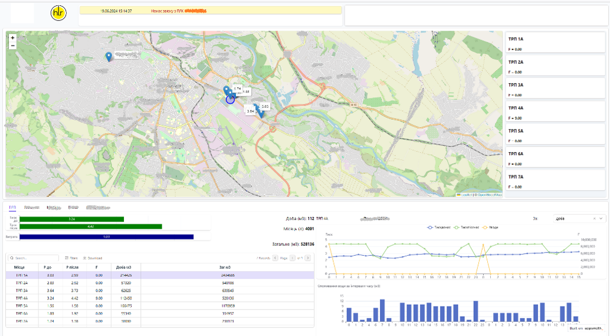
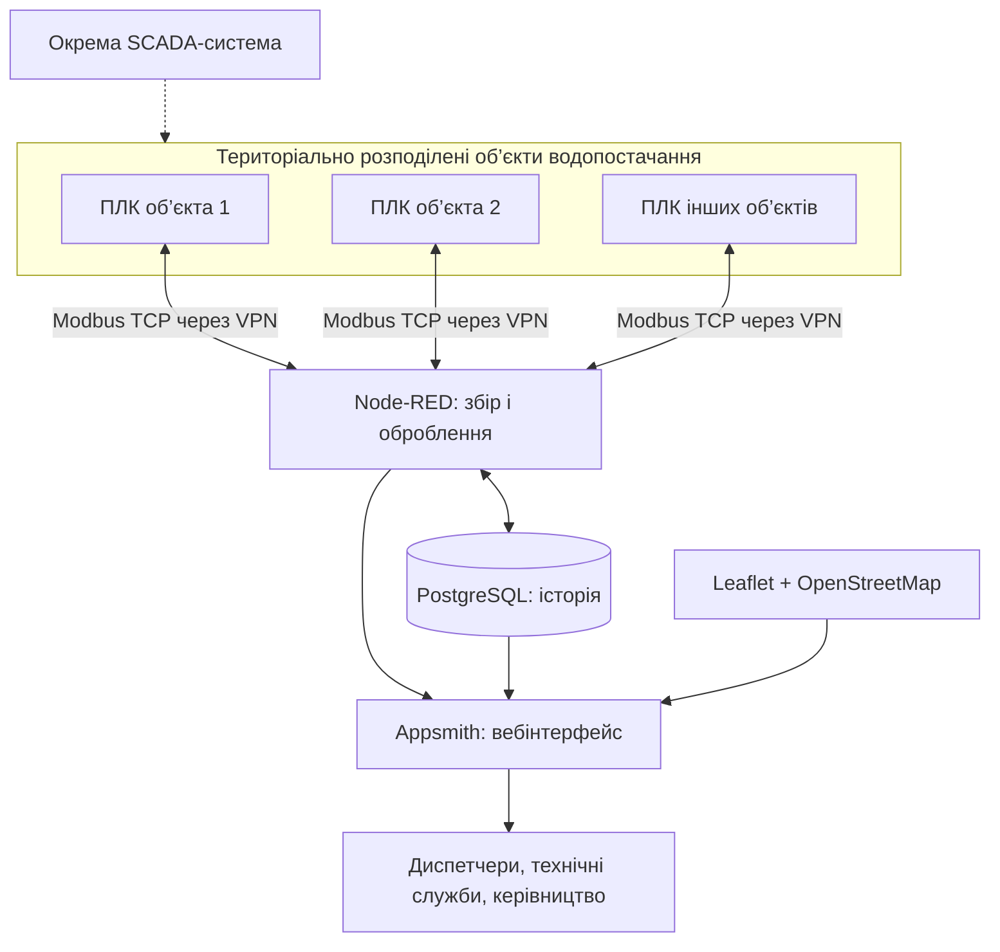

[Сторінка Олександра Пупени](../README.md)

# Система геодиспетчеризації об’єктів водопостачання

**Партнер:** [ТОВ «Хімлаборреактив»](https://med.hlr.ua/) (HLR)  

**Тип рішення:** вебсистема моніторингу та аналітики територіально розподілених об’єктів  

**Статус:** впроваджено, система експлуатується 

**Моя роль:** розроблення серверної частини збору, збереження, оброблення та вебвізуалізації даних.

## 1. Назва та короткий опис

Я розробив систему геодиспетчеризації об’єктів водопостачання для централізованого перегляду поточних технологічних показників і накопиченої історії з територіально розподілених об’єктів. Вона об’єднує дані приблизно з десяти об’єктів на інтерактивній карті, доповнює їх графіками, таблицями та звітами.

Особливість рішення — побудова геодиспетчеризації на основі відкритих технологій, зокрема **Leaflet і OpenStreetMap**, без потреби в окремій комерційній ГІС-платформі. Розроблена система працює поряд з окремою SCADA: вона призначена для інформаційного моніторингу та аналітики, а не для керування технологічним обладнанням.

## 2. Призначення та сфера застосування

Система створена для диспетчерів, технічних служб і керівництва підприємства водопостачання. Вона забезпечує єдине середовище для аналізу роботи насосних станцій, резервуарів, свердловин та інших технологічних споруд.

Основні задачі:

- перегляд розташування та поточних показників розподілених об’єктів на карті;
- оперативний моніторинг витрат води, тисків, рівнів і накопичених об’ємів;
- аналіз історії показників за вибраний період;
- підготовка звітів для експлуатації та управління;
- контроль наявності зв’язку з ПЛК.

## 3. Функціональні можливості

### Інтерактивна карта об’єктів

На карті показано розміщення об’єктів водопостачання та їхні поточні показники. Користувач може перейти від загального географічного огляду до детальнішого аналізу конкретного об’єкта. Дані на карті та сторінках оновлюються автоматично, без перезавантаження браузера.

### Поточні показники та зведення

Вебінтерфейс містить окремі вкладки для різних об’єктів і зведені панелі, на яких подано технологічні параметри, зокрема витрати, тиск, рівні в резервуарах і показники лічильників. Графічні індикатори, таблиці та діаграми дають змогу оцінити поточний стан та порівняти показники.

### Історія, тренди та звіти

Технологічні дані накопичуються у PostgreSQL. Користувач може вибирати довільні періоди для аналізу, переглядати тренди, табличні записи й узагальнені показники. Передбачено завантаження табличних даних для подальшого опрацювання.

Звіти підтримують аналіз водоспоживання, змін тиску, рівнів і накопичених об’ємів у часі. Вони призначені як для оперативного розбору ситуацій, так і для аналізу роботи об’єктів за тривалі періоди.

### Контроль доступності зв’язку

Система відображає втрату зв’язку з ПЛК, щоб користувачі могли відрізнити недоступність даних від штатного відображення. Технологічні аварії та функції керування залишаються в окремій SCADA-системі.

## 4. Архітектура та принцип роботи

Система безпосередньо читає дані з ПЛК територіально розподілених об’єктів через **Modbus TCP**. З’єднання організовані через **VPN**. Збір і оброблення даних виконуються в Node-RED, архівна інформація зберігається в PostgreSQL, а вебінтерфейс створено з використанням Appsmith. Для карти застосовано Leaflet з картографічними даними OpenStreetMap.

Це інформаційний рівень, який доповнює наявну SCADA та не дублює її функцій технологічного керування.

## 5. Технічна реалізація

- **Node-RED** — опитування ПЛК, оброблення та підготовка даних для збереження й візуалізації.
- **PostgreSQL** — накопичення історичних значень і формування вибірок для аналітики.
- **Appsmith** — вебпанелі, таблиці, тренди, елементи навігації та звітність.
- **Leaflet + OpenStreetMap** — інтерактивна географічна карта об’єктів.
- **Modbus TCP + VPN** — захищена мережева взаємодія з віддаленими ПЛК.
- **Docker + Docker Compose** — контейнеризоване розгортання та перенесення системи.

Спочатку система працювала на локальному сервері підприємства, згодом її було перенесено до приватної хмари. Контейнерна архітектура спростила міграцію та подальший супровід.

## 6. Результати та досвід використання

Рішення впроваджене й експлуатується. Воно об’єднало інформацію приблизно з десяти територіально розподілених об’єктів у єдиному вебсередовищі, надавши диспетчерам, технічним фахівцям і керівництву доступ до поточних показників, історії, карти та звітів.

**Головний результат** — приклад практичного використання відкритих технологій для створення повноцінної системи геодиспетчеризації без придбання окремої ліцензійної ГІС-платформи. Архітектура дає змогу розширювати перелік об’єктів і розвивати аналітичні можливості без перероблення чинної SCADA.

**Моя робота:** проєктування та розроблення серверного збору з ПЛК, структури зберігання й опрацювання історичних даних, вебінтерфейсу з картою, панелей моніторингу та звітів, а також контейнеризованого розгортання й перенесення системи.

## 7. Матеріали

**Партнер проєкту:** [ТОВ «Хімлаборреактив» (HLR)](https://med.hlr.ua/).

**Технології:** `Node-RED` · `PostgreSQL` · `Appsmith` · `Leaflet` · `OpenStreetMap` · `Modbus TCP` · `VPN` · `Docker` · `Docker Compose`.
