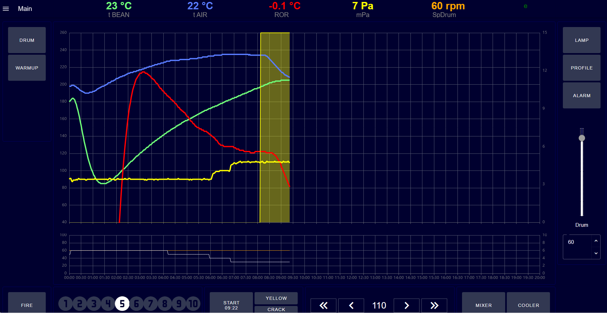
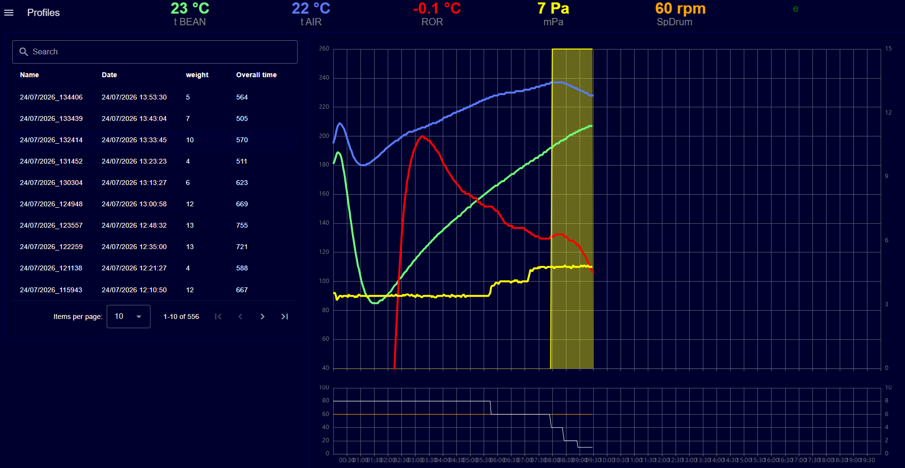
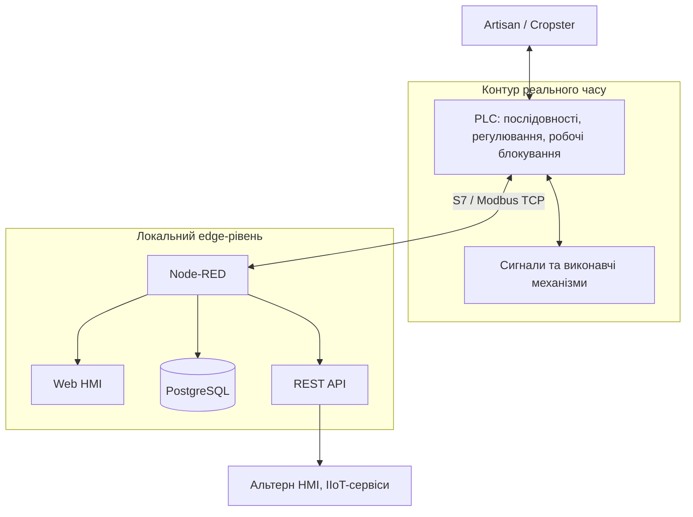
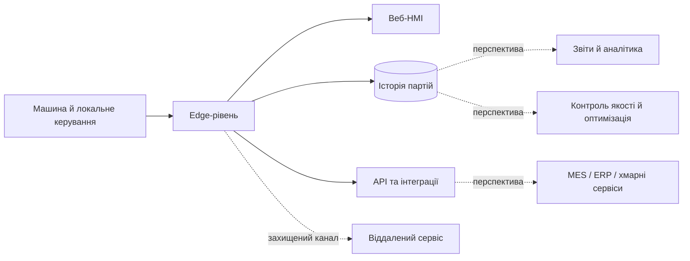
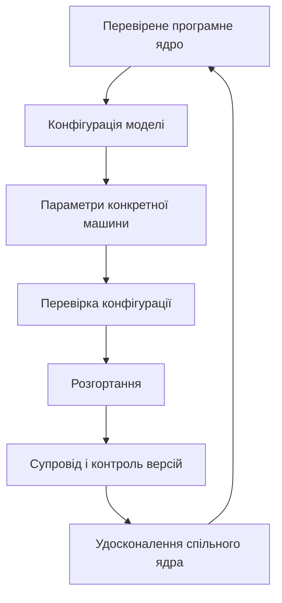

[Сторінка Олександра Пупени](../README.md)

# Система керування машинами обсмаження COGEN

## 1. Назва та короткий опис

**Система керування машинами обсмаження [COGEN](https://cogen-company.com/)** — серійне програмно-технічне рішення для ростерів різної продуктивності та комплектації. Поєднує локальне керування технологічним процесом, вебінтерфейс оператора, історію партій, зовнішні інтеграції та віддалений сервіс.

Концепція рішення — перехід від автоматизації окремої машини до платформи, придатної для тиражування та подальшого розвитку IIoT-сервісів. У реєстрі проєкту є записи розгортань для різних моделей і конфігурацій. Це характеризує масштаб серійної роботи, але не підтверджує однаковий склад, версію ПЗ або поточний експлуатаційний стан усіх установок.

## 2. Призначення та сфера застосування

Рішення призначене для автоматизації машин обсмаження (ростерів), які випускаються серійно та відрізняються комплектацією, продуктивністю, складом сигналів і конфігурацією керування.

Задачі, які вирішує система:

- забезпечення керування окремою машиною;
- збереження параметрів і профілів обсмажування для аналізу та повторного використання;
- віддалена сервісна підтримка;
- підготовка різних конфігурацій системи на основі спільних програмних рішень;
- обмін даними із зовнішніми застосунками (зовнішні ІС керування обсмаженням) й підготовка до інтеграції з виробничими інформаційними системами.

Користувачі: оператори ростерів, наладчики, сервісні інженери, розробники та виробник обладнання.

У традиційній архітектурі такі задачі часто розв'язуються зв'язкою PLC, спеціалізованої операторської панелі та SCADA. У COGEN обрано гібридний підхід із веб-HMI (на базі мікрокомп'ютера Raspberry) та відкритим edge-рівнем, щоб спростити розвиток інтерфейсу, роботу з історичними даними та інтеграції.

## 3. Функціональні можливості

### 3.1. Керування процесом і веб-HMI

В одному інтерфейсі оператор отримує технологічні параметри, графік поточної партії та стан обладнання. Реалізовані сторінки `Main`, `Profiles`, `Settings`, `Alarms`.

Основні можливості:

- запуск і завершення обсмаження партії зеленого зерна кави;
- керування нагріванням, повітряним потоком (стабілізація тиску), обертами барабану, і допоміжними механізмами;
- вибір рівня потужності та робочих уставок;
- контроль температур, RoR (швидкості зміни температури)
- фіксація технологічних подій обсмажування;
- повідомлення про аварії та перегляд журналу подій.

Вебінтерфейс працює у браузері, зокрема в kiosk-режимі (тільки бразуер) на локальних екранах різної роздільної здатності. Нові формати екранів потребують окремої перевірки компонування.

### 3.2. Історія партій і профілі

Реалізовані запис і вибірка даних партій із PostgreSQL, перегляд списку партій, активної партії та окремого профілю. Це забезпечує:

- пошук попередніх обсмажувань;
- порівняння фактичних профілів;
- аналіз відхилень між партіями;
- збереження та призначення профілю партії;
- основу для подальших звітів і контролю якості;
- підготовку окремих конфігурацій для роботи з спеціалізованим ПЗ Artisan і Cropster.

### 3.3. Аварії, діагностика та віддалений сервіс

Передбачено сторінку поточних аварій, журнал аварій та REST-доступ до журналу. Через VPN сервісний фахівець може отримувати авторизований доступ до конкретної установки та аналізувати проблему без попереднього виїзду.

### 3.4. API та інтеграції

Реалізовані HTTP/REST-маршрути для тегів, списку партій, окремої й активної партії, аварійного журналу та роботи з профілями. Інтеграційний рівень створює передумови для підключення зовнішніх застосунків, але інтеграції з майбутніми IIoT-, MES- та ERP-сервісами поки не реалізовані.

### 3.5. Відмінні особливості

- Локальне керування працює окремо від веб-HMI та майбутніх хмарних сервісів.
- Інтерфейс можна розвивати незалежно від базової PLC-програми.
- Реляційна база даних підтримує структуроване зберігання та аналіз історії.
- Відкриті протоколи й API знижують залежність від однієї HMI-платформи.
- Концепція допускає адаптацію для різних машин зі збереженням індивідуальної конфігурації.
- Розвиток нових звітів, API та сервісних функцій не вимагає обов'язкового розгортання повного класичного SCADA-комплексу.

## 4. Архітектура та принцип роботи

### 4.1. Розподіл функцій між рівнями

Використано гібридну архітектуру:

- PLC: технологічні послідовності, регулювання, робочі блокування й керування виконавчими механізмами;
- локальний edge-комп'ютер із Node-RED: обмін даними, веб-HMI, прикладна логіка та REST API; на відміну від традиційних підходів, мікрокомп'ютер заміняє SCADA/HMI та слугує IIoT шлюзом; 
- PostgreSQL: історія партій і журнал подій;
- браузер: операторський клієнт;
- промислові протоколи: обмін між PLC, edge-рівнем і зовнішніми системами;
- VPN: захищений канал для авторизованого сервісу.

Принципове розмежування: детерміноване технологічне керування та робочі блокування залишаються на PLC-рівні; веб-HMI, історія та інтеграції — на edge-рівні. Відмова браузера або перезапуск edge-застосунку не підміняють технологічну логіку PLC. Функції машинної безпеки виконуються відповідними апаратними та safety-рішеннями, а не Node-RED чи стандартною PLC-логікою. 

### 4.2. Масштабування та серійність

Система розділяє локальне керування, edge-функції, HMI, історію та API, тому компоненти можуть розвиватися окремо. Конфігурація конкретної установки відокремлюється від спільних програмних функцій. Для різних контролерів і моделей використовуються окремі проєкти та параметри.

Напрям розвитку серійного продукту — **спільне перевірене ядро та окремі пакети розгортання**. Для різних установок уже існують окремі flows і конфігурації, однак їх уніфікація ще триває. Під час підготовки нової установки адаптуються склад сигналів, режими керування, екран, мережа та зовнішні інтеграції.

Мета уніфікації — скоротити підготовку наступних машин, зменшити випадкові відмінності між установками, спростити оновлення та супровід, підтримувати сумісність і забезпечити простежуваність змін за серійними номерами. 

## 5. Технічна реалізація

### 5.1. Платформи та технології

| Складова                 | Технології                                                   |
| ------------------------ | ------------------------------------------------------------ |
| PLC і мови програмування | IEC 61131-3; Structured Text / SCL                           |
| Контролери й середовища  | 2 варіанти: 1) Siemens S7-1200, TIA Portal; 2) Schneider Electric M172, EcoStruxure Machine Expert – HVAC |
| Edge і прикладні функції | Node-RED, JavaScript                                         |
| Обмін даними             | Modbus RTU/TCP, S7, OPC UA, HTTP/REST API                    |
| Історія даних            | PostgreSQL (старі версії на MariaDB)                         |
| Розгортання й супровід   | Docker + Portainer (нові версії), VPN                        |
| Зовнішні програми        | Artisan, Cropster (окремі конфігурації / інтеграційні сценарії) |

Наведено технологічну основу проєкту загалом; це не означає, що всі перелічені технології використовуються на кожній установці.

### 5.2. Конфігурації та супровід установок

Для кожної машини ведеться окремий каталог конфігурації. Адреси, параметри та flows однієї установки не переносяться на іншу без перевірки. Перед змінами Node-RED передбачено повне резервне читання flows, а після розгортання — контрольне читання.

Під час тиражування враховуються відмінності складу сигналів, параметрів, мережі, екрана та зовнішніх підключень. Для Siemens S7-1200 і Schneider Electric M172 є окремі PLC-проєкти; стандартизація обміну та конфігурацій триває.

### 5.3. Поточний стан реалізації

| Функціональність                                     | Стан                                              |
| ---------------------------------------------------- | ------------------------------------------------- |
| Локальне керування фазами та командами оператора     | Реалізовано в наявних PLC-проєктах                |
| Веб-HMI, тренди, події та аварії                     | Реалізовано                                       |
| Історія партій у PostgreSQL                          | Реалізовано                                       |
| Інтеграція Siemens S7-1200 і Schneider Electric M172 | Окремі проєкти; уніфікація триває                 |
| Віддалений сервіс через VPN                          | Реалізовано                                       |
| Окремі пакети й записи розгортань                    | Є для серії установок; структура стандартизується |
| Уніфікований обмін через Modbus TCP/ S7 TCP/IP       | Стандартизація та перевірка                       |
| Єдина структура конфігурації для різних моделей      | У розвитку                                        |
| Централізована IIoT-аналітика парку машин            | Передбачено архітектурою; наступний етап          |

Нові можливості необхідно перевіряти на фактичній конфігурації перед серійним використанням. Поведінка історичної бази за тривалої втрати зв'язку також потребує перевірки для кожного варіанта розгортання.

## 6. Результати та досвід використання

### 6.1. Практичне застосування

Система використовується в серії машин різних моделей і конфігурацій; у реєстрі є записи розгортань кількох десятків машин. Реалізовано локальне керування, веб-HMI, зберігання історії партій та віддалений сервіс. Окремі конфігурації й версії установок потребують індивідуального супроводу.

### 6.2. Практична цінність

- Тиражування: повторне використання перевірених функцій зменшує обсяг індивідуальної розробки та потенційно скорочує введення в експлуатацію.
- Діагностика: історія аварій і дистанційний доступ полегшують пошук несправностей та можуть скорочувати простої.
- Відтворюваність: фактичні профілі та параметри партій доступні для порівняння й повторного використання.
- Відкритість: вебтехнології, PostgreSQL, HTTP API та промислові протоколи створюють точки інтеграції.
- Кероване масштабування: загальні програмні частини співіснують із конфігураціями окремих машин.
- Зменшення ризиків під час змін: резервні копії, контрольне читання та поетапне впровадження підтримують обережне оновлення діючих систем.

Кількісних показників скорочення простоїв, часу введення в експлуатацію або економії у вихідних матеріалах немає.

### 6.3. Моя роль у проєкті

Я працюю як розробник цілісної системи керування — від технологічних вимог і PLC-алгоритмів до HMI, збереження даних, інтеграцій та супроводу. Зокрема:

- перетворюю технологічні вимоги на архітектуру;
- розмежовую локальне керування, візуалізацію, історію та інтеграції;
- розробляю PLC-логіку, HMI, Node-RED flows і структури даних;
- інтегрую контролери, приводи, бази даних і зовнішні програми;
- враховую серійність, окремі конфігурації та їхній життєвий цикл;
- організовую розгортання, резервне копіювання й віддалену підтримку;
- документую систему для операторів, наладчиків і сервісних інженерів;
- передбачаю можливості розвитку IIoT, аналітики та виробничих функцій.

### 6.4. Обмеження й напрями розвитку

Поточна архітектура дає основу для наступних функцій, але вони не представлені як завершені впровадження:

- повна автоматизація обсмажування за вибраним збереженим профілем (наразі триває розробка);
- централізований огляд парку машин із розмежуванням доступу;
- автоматичні виробничі звіти;
- контроль стабільності партій та сповіщення про відхилення;
- облік напрацювання механізмів (реалізований частково) і планування технічного обслуговування;
- централізований облік резервних копій та версій конфігурацій;
- порівняння ефективності установок із розділенням даних клієнтів;
- централізований каталог рецептів із локальним підтвердженням;
- кероване розгортання оновлень із журналом, резервним копіюванням і перевіркою стану;
- прогнозна діагностика та оптимізація процесу.

Майбутня гібридна архітектура передбачає незалежне локальне керування й централізовані функції переважно для даних та сервісу. Уніфікація програмного ядра, конфігурацій і обміну з PLC триває.

## 7. Демонстрація та матеріали

### 7.1. Скриншоти

- [Головний екран керування ростером](media/image-20260725224848077.png) — поточні параметри й графік партії.
- [Історія партій і порівняння профілів](media/image-20260725224950378.png) — робота з технологічною історією.

### 7.2. Схеми

Не для публічного доступу.

### 7.3. Додаткові матеріали

Посилання на відеодемонстрацію, публічну документацію та GitHub у вихідному описі відсутні

