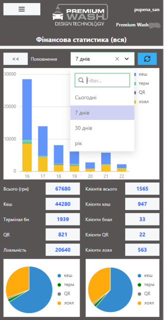
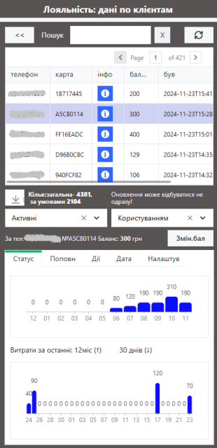
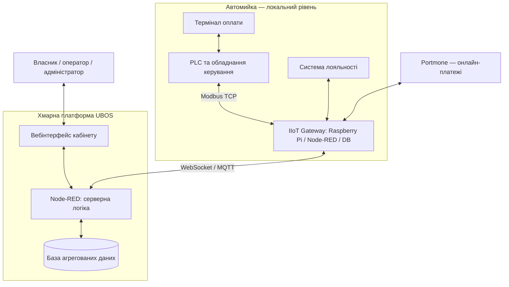

[Сторінка Олександра Пупени](../README.md) -> [Портфоліо](README.md)

# Premium Wash - платформа диспетчеризації та менеджменту автомийок самообслуговування

Електронний кабінет власника автомийок, що об’єднує віддалений контроль роботи обладнання, облік і аналіз оплат, систему лояльності, сервісну діагностику та інтеграцію онлайн-платежів. Рішення поєднує наявну систему локального керування автомийкою з IIoT-шлюзом і хмарним вебзастосунком.

## 1. Назва та короткий опис

**Замовник:** [Premium Wash](https://premium-carwash.com/) — компанія, що розробляє автомийки самообслуговування.

**Рішення:** система диспетчеризації та менеджменту автомийок («Електронний кабінет власника») з локальним IIoT-шлюзом.

Система надає власникам автомийок доступ через вебінтерфейс, адаптований до смартфона, до фінансової та технічної інформації, історії транзакцій, операцій з картками лояльності та засобів діагностики. На локальному рівні IIoT-шлюз збирає дані з контролера, термінала й інших підсистем, зберігає архіви та забезпечує обмін із хмарною платформою.

**Стан на момент описаного впровадження:** комерційне рішення, що експлуатується. Кілька десятків автомийок самообслуговування та кілька портальних мийок. 

## 2. Призначення та сфера застосування

Рішення створювалося для власників та сервісної служби мережі автомийок Premium Wash. Його призначення — перетворити дані й операції локальної системи керування на доступні дистанційно інформаційні та управлінські функції.

Основні задачі:

- віддалено бачити виручку й джерела поповнення постів;
- вести статистику використання програм мийок, джерел поповнення, тощо;
- контролювати готівку та інкасацію;
- досліджувати використання постів, аксесуарів і програм миття;
- контролювати транзакції термінала, QR-оплати та системи лояльності;
- з’ясовувати причини помилок або спірних оплат;
- фіксувати технічні події та підтримувати сервісні роботи;
- надавати різні функції власникам, операторам і адміністраторам.

Рішення є IIoT платформою з підключенням наявних локальних систем керування. Програмування PLC і локального термінала входило до іншої частини системи й не було предметом цього проєкту.

## 3. Функціональні можливості

### 3.1. Фінансовий контроль і статистика

**Фінансова статистика** показує поповнення постів, аксесуарів і термінала за джерелами: готівка, банківська картка через термінал, карта лояльності та QR. Можна переглядати сьогоднішні показники, вибраний день, останні 7 або 30 днів і останні 12 місяців із відповідним погодинним, поденним чи помісячним розподілом.

Окремо реалізовано статистику готівкових поповнень. Дані ґрунтуються на локальних архівах, а агреговані показники за документацією оновлюються з періодичністю приблизно 30 хвилин. 

**Контроль постів** дає змогу переглянути внески на конкретний пост або аксесуар за сьогодні чи за вибрану добу, з розподілом за способами оплати. Ураховується також термінал як окреме джерело готівкових внесків. Є загальна сума внесків та орієнтовний показник кількості клієнтів.

**Контроль готівки та інкасації** відображає накопичену в купюро- й монетоприймачах суму після останньої інкасації. Інкасацію можна зареєструвати для окремого поста або всієї автомийки, після чого лічильники обнуляються, а дата й час дії зберігаються в системі. Зберігається історія інкасацій для вибраного періоду.

### 3.2. Контроль платежів: термінал і QR

**Журнал термінала** містить усі операції за вибрану добу: час, призначення поповнення (пост, аксесуар або картка лояльності), номер об’єкта чи рахунку, спосіб оплати. Передбачено агреговані підсумки за готівкою, банківськими картками, постами/аксесуарами та лояльністю.

**Оплата за QR-кодами** реалізована через інтеграцію з Portmone. Система відрізняє факт проведення платежу від фактичного зарахування коштів на пост або аксесуар. Для цього передбачено два інформаційні рівні:

- **Журнал по QR** — стан платежів у Portmone: створено, оплачено або відхилено. Він доступний у кабінеті навіть тоді, коли система керування мийкою відключена від Інтернету.
- **Операції QR у сторінці оператора** — результат передавання оплаченого платежу в систему керування: успішно, отримано оплату, але ще не зараховано, або помилка зарахування.

У документації описано обмеження за часом при втраті зв’язку: система не повинна здійснювати надто пізнє зарахування на пост після оплати. Це зменшує ризик небажаного запуску послуги після значної затримки; такі випадки підлягають окремому розбору за журналами. Різні часові межі наведено для обміну з Portmone та спроби зарахування в PLC — вони стосуються різних етапів операції.

### 3.3. Система лояльності

Кабінет інтегрується з наявною базою лояльності автомийки й надає:

- відомості про активність клієнтів і використання карток;
- історію поповнень і витрат по постах;
- аналіз транзакцій для розв’язання спірних ситуацій;
- поповнення балансу картки з кабінету, зокрема оператором;
- реєстрацію змін балансу та інших операцій.

Ця функціональність використовується також для партнерських карток і сервісного розбору ситуацій, коли оплата або надання послуги відбулися нештатно.

### 3.4. Сторінка оператора та діагностика

**Сторінка оператора** зводить в одному місці транзакції за поточну добу: поповнення постів, QR-операції, транзакції термінала та події. Таблиці дозволяють сортування за колонками; за документацією дані оновлюються автоматично кожні 10 секунд.

Журнал подій реєструє, зокрема, втрату та відновлення зв’язку IIoT-шлюзу з PLC, хмарною платформою, базою лояльності та Portmone, а також зміни балансів лояльності. Це дає змогу зіставляти платежі, роботу обладнання й мережеві збої.

### 3.5. Технічна статистика та сервіс

Передбачено статистику використання програм миття та їхньої тривалості за вибрану дату або період. Окремий функціональний блок призначений для контролю сервісних операцій і технічного обслуговування.

**Поклієнтний аналіз** реконструює орієнтовні «заїзди» за непрямими ознаками активності на постах — поповненнями, вибором програм і періодами бездіяльності. Для кожного заїзду доступна хронологія дій. Це інструмент технічного аналізу, а не точний облік фізичних автомобілів: оцінки кількості клієнтів, меж заїзду та тривалості можуть бути неточними.

### 3.6. Адміністрування

Для адміністраторів Premium Wash доступні додаткові засоби керування платформою та сповіщення через ботів. Конкретний перелік адміністративних операцій залежить від конфігурації й прав користувача.

## 4. Архітектура та принцип роботи

Система має три логічні рівні: існуюче локальне керування, локальний IIoT-шлюз і хмарний електронний кабінет.

**PLC і локальне обладнання.** Виконують базові функції автомийки. Вони існували до створення електронного кабінету, і їхня розробка не входила до описаного обсягу робіт.

**IIoT Gateway.** Raspberry Pi з Node-RED забезпечує Modbus TCP-обмін із PLC, взаємодію з платіжним терміналом, базою лояльності й Portmone, локальне збирання та архівування даних і передавання інформації на платформу. Документація описує також локальний інтерфейс контролю автомийки.

**Хмарна платформа.** На платформі Ubos розміщено Node-RED, засоби побудови користувацького інтерфейсу, базу даних та інфраструктуру обміну через MQTT/WebSocket. Браузер є клієнтом власника, оператора й адміністратора.

**Розділення зберігання.** Детальні архівні дані залишаються на локальному Raspberry Pi. У хмару періодично передаються статистично оброблені показники. Деякі журнали та дані лояльності запитуються з локального вузла за потреби, через що їхнє завантаження може бути повільнішим.

Архітектура дозволяє масштабувати доступ до кількох мийок без перенесення технологічного керування в хмару.

## 5. Технічна реалізація

### Основний стек

| Рівень | Технології та засоби |
|---|---|
| Локальне керування | PLC, Modbus TCP; наявні термінали та локальні підсистеми |
| Edge | Raspberry Pi 4/5, Raspberry Pi OS, Node-RED |
| Локальні дані | MariaDB/MySQL |
| Хмарна платформа | Ubos LoCode: Node-RED, конструктор вебінтерфейсу, база даних, MQTT-брокер, MongoDB |
| Зв’язок | Modbus TCP, WebSocket, MQTT; інтеграції з терміналом і лояльністю |
| Платежі | Portmone та QR-посилання |
| Експлуатація | Експорти Node-RED/UI, конфігурації окремих Raspberry Pi, засоби моніторингу Telegraf у процедурі розгортання |

### Особливості реалізації

- Вебінтерфейс адаптований до смартфона й не потребує спеціалізованого клієнтського програмного забезпечення.
- Наявна система керування розширена без переписування її PLC-програми в межах цього проєкту, однак була певна адаптація з боку програміста PLC для інтегрування
- Локальне зберігання детальних архівів зменшує обсяг даних, який потрібно тримати на хмарній платформі.
- Журнали різних підсистем дозволяють розділити «платіж прийнято» й «послугу зараховано» та аналізувати збої.
- Права доступу й набір функцій розрізняються для власника, оператора та адміністратора.
- Застосування LoCode/Node-RED дає змогу змінювати прикладну функціональність без переходу на монолітний спеціалізований програмний продукт.

**Важливі межі та залежності:** користування Ubos передбачає платну підписку; доступність оперативних віддалених функцій залежить від зв’язку; частина аналітики оновлюється періодично. 

## 6. Результати та досвід використання

### Практичне впровадження

Проєкт починався з мінімально працездатної версії (MVP): перші функції кабінету були доступні приблизно через місяць після укладення договору. Подальший функціонал допрацьовувався в реальній експлуатації протягом приблизно року.

Серед об’єктів, крім автомийок самообслуговування, наразі є дві портальні мийки. Замовник брав участь у постановці вимог і перевірці фінансових показників, а зміни функціональності вносилися під час роботи системи.

### Практична цінність

- Власник отримує віддалений доступ до фінансової та технічної інформації без безпосередньої присутності на автомийці.
- Оператор і сервісна служба можуть відновлювати послідовність подій під час проблем із платежами або зв’язком.
- Операції з готівкою, лояльністю, QR та терміналом стають доступними в єдиному інтерфейсі, хоча зберігають окремі джерела даних.
- Прозорі журнали транзакцій допомагають розбирати спірні випадки.
- Поступовий MVP-підхід дозволив отримувати користь ще до завершення всієї функціональності.

Кількісна економія, скорочення простоїв і фінансовий ефект у вихідних матеріалах не виміряні; їх не слід подавати як доведені результати.

### Моя роль у проєкті

Я виступав розробником електронного кабінету та інтеграційного IIoT-рівня: перетворював вимоги замовника на прикладну архітектуру, реалізовував вебфункції й Node-RED-потоки, інтегрував систему з наявним керуванням, локальними базами, лояльністю та оплатами. До роботи входили перевірка, виправлення й розвиток функціональності в експлуатації.

Локальну PLC-програму автомийок розробляв інший фахівець. Після завершення договірних робіт вихідні коди передано замовнику, якому вони належать. Це було індивідуальне комерційне рішення для Premium Wash, а не публічно поширюваний готовий продукт.

### Обмеження й можливості розвитку

Подальший розвиток може включати нові управлінські звіти, поглиблену технічну аналітику, додаткові інтеграції та покращення сервісної діагностики. 

## 7. Демонстрація та матеріали

- [Premium Wash — сайт замовника](https://premium-carwash.com/).
- [Ubos — використана LoCode-платформа](https://ubos.tech/).
- Кількість демонстраційний скриншотів обмежено власником платформи, наведені вище скрини узгоджені з власником Premium Wash.
