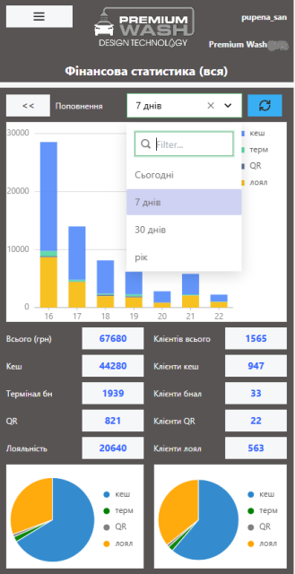
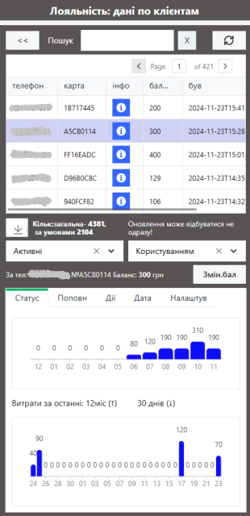

# Кейс цифровізації: електронний кабінет власника автомийок самообслуговування

Вже більше 5 років я рухаюся в напрямку впровадження в промисловій автоматизації технологій промислового Інтернету речей та LoCode - платформ та інструментів розроблення програмного забезпечення з використанням візуальних конструкторів та нескладного програмування. Навіть близько року відмовлявся від класичних проектів програмування АСКТП (автоматизованих систем керування технологічними процесами) на користь виділення часу на самонавчання необхідних технологій ІТ. До певного часу, замовлень щодо необхідності впровадження чогось більше за ПЛК та SCADA/HMI не було. Зараз ситуація змінилася, з'являються клієнти, яким необхідно контролювати різноманітні витрати або облікувати матеріали через інтеграцію з власними ІТ-системами або створеними у веб-застосунку. І тут потребуються знання як класичних систем керування так і стек IT, що має відношення до IoT. Перший такий успішний (на мою думку) комерційний кейс почав запроваджуватися рік тому не в області промислової автоматизації, а на автомийках. 

Замовником стала компанія по розробленню автомийок самообслуговання Premium Wash https://premium-carwash.com/, власники якої бачили нагайну потребу в створенні електронного кабінету власника. І тільки зараз, через рік, можна сказати що розроблений кабінет набув своєї усталеної форми і про нього можна казати як про завершений. Тепер він має той функціонал, який задумувалося, не без змін в технічних вимогах. На своіх каналах я обіцяв, що розповім про цю історію, тому з дозволу директора Premium Wash публікую цю статтю. Враховуючи, що стаття може зацікавити різні групи читачів, я вирішив її розбити на дві частини. Перша - про функціонал кабінету, друга - технічна, про стек технологій. Отже, частина перша.     

## Як все починалося

Власники Premium Wash знайшли мене за об'явої на Work.ua. Хоч в моєму резюме не було вказано, що я вмію розробляти "кабінети власника", там були вказані суміжні скіли, по типу програмування контролера. Роботи по розробці кабінету до цього починала робити якась ІТ компанія, але, на скільки я зрозумів, вони не виконали свої зобов'язання а результати їх діяльності я навіть не бачив. Замовнику я пояснив, що подібного досвіду не маю, однак маю чітке представлення стеку технологій і можу зробити це з використанням LoCode платформи https://ubos.tech з яким на той час ми досить тісно співпрацювали. Я вже мав навіть певний досвід роботи з Ubos безкоштовних пілотів, але без продакшина (не достатньо зацікавило), а це особливо і не покладеш в портфоліо. Отже, власники Premium Wash були усвідомлені про ризики "важкого старту", проте вони таки наважилися піти на це, бо треба рухатися вперед. Ми підписали договір, і кабінет десь через місяць вже мав мінімальний функціонал (MVP).

## Що зараз

Більша частина функціоналу було описано в технічному завданні, що звісно значно спростило мені роботу, бо на той момент я навіть не знав як працює мийка самообслуговування. Тут треба віддати належне замовнику, у завданні був добре розрисований інтерфейс з вказівкою логотипів, кольорів і всілякі деталі, видно що ідея пророблялася довго і скурпульозхно. У світі промислової автоматизації, в якому здебільшого мої об'єкти, таке нечасто буває. Деякі функції були добавлені пізніше в процесі розроблення, і це звісно також очікувано. Деякі функції за згодою з замовником не були реалізовані, і навряд чи в них буде потреба в майбутньому. 

На момент написання статті доступ до свого кабінету мають сім власників автомийок і надалі кількість клієнтів зростає. Кабінет надає різноманітну інформацію в онлайн через веб-сторінку, адаптовану під смартфон. Це фінансова інформація, технічна статистика, можливість контролю та керування системою лояльності та сторінка для оператора. Про деякі з функцій, які я можу відкривати назагал, за згоди замовника, я напишу нижче.           

Варто зазначити, що частина реалізованого функціоналу вже була реалізована на локальних терміналах. По факту, розроблювальна система вже інтегрувалася з існуючою АСКТП (її програмує інший програміст) саме для віддаленого контролю зі смартфону. Додатково виникла необхідність реалізації оплати по QR-коду, що також стало частиною рішення. 

Функції фінансового контролю надають інформацію про наявний кеш в купюроприймачах, та можливість відмітити проведення інкасації як по кожному посту, так і для всієї мийки. Також власник може  подивитися перелік проведених інкасацій з сумами за вибраний період. Окрім поточних фінансів кабінет надає різноманітну статистику - зокрема за вибраний період з вказівкою різних джерел прибутку.  

Технічний контроль надає іншу статистику, по використанням програм миття та тривалостей цих програм за вибраний період або за вказану добу. Є окрема сторінка для налаштування проведення робіт по техобслуговуванню, це на мою думку більше цікаво сервісникам аніж власникам.

Дуже важливим виявився функціонал контролю системи лояльності. На початку реалізації системи я не розумів на скільки такий контроль потрібен, поки не став присутнім при визначенні причин деяких історій.  За допомогою цієї частини кабінету власник може подивитися активність клієнтів лояльності, подивитися статистику використання, поповнення карти лояльності, та використання коштів. 

По кожному клієнту лояльності можна прослідити час поповнення, витрати на пости. Це потрібно коли є якісь збої в роботі, на кшталт перебоїв з живленням, іншими непердбачуваними технічними несправностями. Окремою є функція поповнення карти лояльності з кабінету. Це особливо потрібно для оператора мийки (коли пішло щось не так) і для партнерських карток лояльності. Усі транзакції щодо поповнення з кабінету також фіксуються, як і багато чого іншого. 

В кабінеті є також додатковий функціонал, який доступний тільки адміністраторам Premium Wash - це адмініструванням системи, сповіщення через боти та інше. 

Окрім автомийок самообслуговування, в переліку є одна портальна мийка. Власник цієї автомийки відіграв велику роль в наповненні функціоналу кабінету. Він знав, чого хоче, скрупульозно перевіряв усі числа і вказував мені на мої помилки. Думаю попереду буде ще багато клієнтів і функціонал кабінету буде також нарощуватися. 

## Що далі

Ми закрили усі договори з замовником, але в планах продовжувати нашу співпрацю. Усі вихідні коди йому передані і є його власністю. Враховуючи, що проект розроблений з використанням відкритих добре-відомих інструментів LoCode та технологій (про них я напишу в 2-й частині), його може продовжувати обслуговувати інша людина, хоча звісно з відповідною підготовкою. Наразі про таку заміну не йдеться, однак на мою думку така можливість у власника має бути, і LoCode платформи на кшталт Ubos це дозволяють. 

Власне для мене - це успішний кейс впровадження промислового Інтернету речей, який дає можливість використати сучасні технології для цифровізації різноманітних бізнес-задач, пов'язаних з обладнанням та матеріалами. Я не планую реалізовувати подібне для інших власників компаній розроблення автомийок, мене влаштовує мати одного надійного замовника в цьому бізнесі, з яким ми будемо мати довготривалі партнерські відносини. Натомість мені цікаво переносити цей кейс для інших підприємств МСП (малі та середні підприємства). Цей кабінет розроблений однією людиною, з використанням доступних по фінансам для МСП ресурсів. Це значить, що технологічні та бізнес-процеси інших МСП можуть бути так само цифровізовані. Зараз ведуться роботи в іншому сегменті, про який писати ще рано, але сподіваюся це буде 2-м подібним кейсом. 

Є маленькі приклади інтегрування обладнання з ІТ-застосунками, і таких прикладів стає все більше. На відміну від описаного в статті рішення, на створення якого у мене пройшов рік, такі маленькі застосунки реалізовуються за кілька днів. Однак не варто думати, що кабінет власника почав працювати через рік після початку робіт. Він працював з перших днів і приносив результати з мінімальним функціоналом. Цей підхід (MVP) наразі є прийнятим не тільки в ІТ а і в промисловій автоматизації (Індустрія 4.0/5.0). І його дієвість я перевірив на практиці. Варто шукати партнерів і впроваджувати цифрові рішення одразу там, де вони приносять результати. Наразі технічно це можливо зробити.   

І ще. Тепер на своїх курсах по промисловому інтернету речей та LoCode я можу сміливо розказувати, що це все працює і приносить користь бізнесу клієнта.     

Звертайтеся, я відкритий для співпраці і буду радий проконсультувати. 

Ну і звісно, звертайтеся до Premium Wash https://premium-carwash.com/ якщо Ви захотіли стати власником автомийки самообслуговування, або вже є ним, але хочете покращити свій бізнес. Це надійний і відповідальний партнер, який постійно розвивається і відкритий для інновацій. 

Ну, а кому цікава технічна сторона питання - чекайте другої частини.            

[Олександр Пупена](https://pupenasan.github.io/)